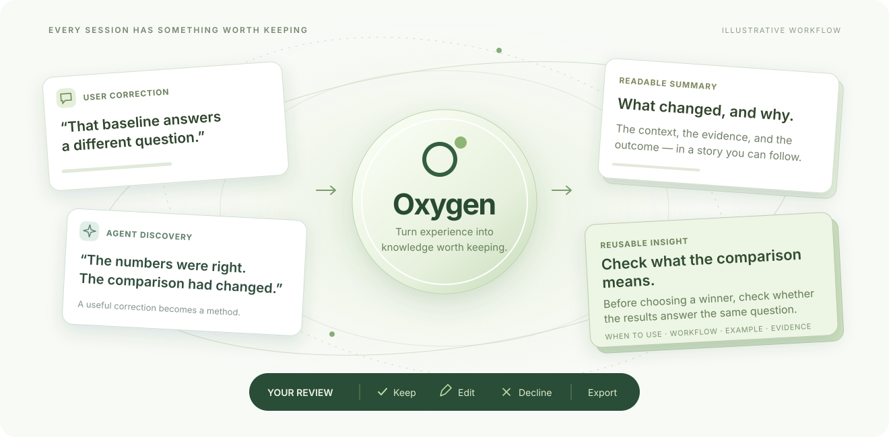

<div align="center">

<h1>
  
  &nbsp;oxygen-contributor-kit
</h1>

**Turn agent sessions into knowledge worth keeping.**

[Quick start](#launch-the-complete-pipeline-from-codex) · [Review app](review-app/README.md) · [Contributors](#contributors)



</div>

Long sessions contain more than completed tasks. They capture the corrections,
discoveries, and decisions that make future work better. Oxygen turns those
sessions into readable summaries and reusable skill candidates, with evidence
links and a review interface for deciding what to keep, edit, or decline.

---


## Launch the complete pipeline from Codex

With the toolkit already cloned under your workspace, open Codex there and paste
the instruction below. Adjust the toolkit folder name if needed.

```text
Follow steps 1–5 in ./oxygen-contributor-devkit/readme.md and its referenced skill to run the complete pipeline for the current workspace, through local review import. Save outputs in a new timestamped run directory. Validate the results and report counts, failures, links to the final artifacts, and the local review URL.
```

### Prerequisites and defaults

- Git and Python 3.10 or newer; Node.js 22.13 or newer and npm for the review app.
- Locally recorded Codex sessions for the target workspace, under `$CODEX_HOME`
  or `~/.codex`. A Git clone alone does not include its contributors' session logs.
- A Codex host exposing the skill's `collaboration.spawn_agent` interface with
  `gpt-6.1-sol`, high reasoning, and fresh context (`fork_turns="none"`). Check
  these capabilities before dispatch. The Python helper prepares and validates
  calls; it does not launch model workers by itself.
- Access to the npm registry when review-app dependencies need installation.

The default pilot converts **all** collected snapshots, then processes **up to
three** eligible Markdown trajectories through the remaining stages. To summarize
every eligible trajectory, append “Process all eligible trajectories instead of
sampling three” to the instruction. The worker concurrency limit remains three,
capped at the host's available capacity.

Capture the target root with `git rev-parse --show-toplevel` before entering the
toolkit directory. Pass that saved absolute path to collection's `--workspace`;
the toolkit's directory is not automatically the target workspace. Use a unique
UTC timestamp such as `20260922T203000Z` for each run, create its directory with
private permissions, and keep generated artifacts out of commits. Record the
toolkit revision and any local modifications in the run report. App dependencies
and local database state live under the toolkit's `review-app/` directory.

## Repository layout

The collection and stripping steps are standalone Python tools; the agent workflow is the remaining skill:

- `prompts/summary.md` — readable thematic summaries grounded in the source.
- `prompts/insight.md` and `prompts/insight-card-format.md` — summary corrections,
  reusable skill-candidate extraction, and the shared six-field card schema.
- `prompts/sensitive-redaction.md` — minimal privacy edits that preserve
  nonsensitive content and formatting.
- `tools/` — utilities and supporting tools.
- `skills/oxygen-deterministic-trajectory-agents/` — summary, insight, and privacy-redaction workers.
- `review-app/` — the Oxygen human-review service and evidence-linked review UI.

## 1. Collect workspace sessions

Run these commands from the toolkit root. The tools use the Python standard library;
token counting is an optional dependency described below. Create a new private run
directory outside Codex session storage, then collect frozen snapshots:

```bash
umask 077
mkdir /absolute/private-run
python3 tools/collect_workspace_sessions.py \
  --workspace /absolute/target-workspace \
  --output-dir /absolute/private-run/collection
```

The collector searches `sessions` and `archived_sessions` beneath `$CODEX_HOME`,
falling back to `~/.codex`. Use `--codex-home` for another local store.
`--dry-run` discovers matching paths without copying or writing files; the output
directory is optional in that mode.

Workspace membership comes from the initial `session_meta.payload.cwd`, including
descendant directories. Paths mentioned in messages and later directory changes
do not determine membership. Recognized main sources are `cli`, `vscode`, and
`exec`; every `source.subagent` variant is excluded. Main-session forks remain
eligible.

Inspect the content-free manifest printed to stdout and saved as
`collection/manifest.json`. Report selection/exclusion counts, errors, and output
locations. Zero matches is a successful empty result. Missing active storage,
unknown metadata, unreadable paths, symlinks, and snapshot failures make collection
incomplete and return a nonzero status; successful snapshots remain available.
Missing archive storage is acceptable.

### Snapshot contract

Each snapshot preserves the source bytes through the last complete newline within
the size observed when the source was opened. Later appends are allowed. A second
prefix read checks its hash; observed replacement, truncation, metadata changes,
or prefix edits reject that snapshot. This is an append-only prefix check without
locking the writer, not a transaction over the whole session store. Sessions
created after discovery require another collection.

Manifest `sessions` entries contain the source path, session ID, recorded working
directory, relative `snapshot_path`, SHA-256, and byte length. `source_locations`
records initial sizes and omitted trailing bytes. Byte-identical prefixes with the
same session ID share one snapshot; different prefixes stay separate. Dry-run
entries contain discovery metadata only. Directories use `0700`, files use `0600`,
and existing output destinations are refused. Collection validates initial
metadata; the stripper validates the complete rollout structure.

## 2. Strip outputs and export Markdown

Process every collected manifest entry, resolving each `snapshot_path` relative to
the collection directory. Keep the input snapshots for provenance. For each
snapshot, generate both the structurally stripped JSONL and the Markdown
transcript used by the workers. Complete this conversion before applying the
pilot's size limit or selecting its three trajectories:

```bash
python3 tools/strip_tool_outputs.py \
  /absolute/private-run/collection/snapshots/SNAPSHOT.jsonl \
  --output /absolute/private-run/trajectory-001.jsonl \
  --markdown /absolute/private-run/trajectory-001.md \
  --report /absolute/private-run/trajectory-001.strip.json
```

All parent directories must exist. Every output must be a new, distinct path.
`--markdown` is optional when only a stripped JSONL copy is needed. A previously
stripped JSONL file can be supplied to this same command with new output paths.
To recover user-input results discarded by an older filter, use the original
collected snapshot; a previously stripped file cannot restore missing answers.
Markdown export uses the filtered records, so it cannot reintroduce removed raw
tool outputs or encrypted fields. The tool validates and renders the Markdown
before publishing either trajectory. Publishing multiple files is not atomic;
on a filesystem failure, preserve any completed artifacts and use new paths for
a subsequent attempt.

Inspect the content-free JSON report unless the contributor asks to inspect
conversation text. It records input/output hashes and sizes, removal counts by
carrier, encrypted-field and encrypted-subagent-message counts and value bytes, compaction counts, and retained
tool-call counts and retained user-input result counts. With `--markdown`, it also records Markdown hashes/bytes,
section/role counts, exclusions, and source record numbers. Its injected-content
inventory lists omitted message/block counts, roles, reasons, and record numbers,
including partially filtered user messages. Those record numbers
refer to the stripped JSONL, not the raw snapshot.

### Markdown format and selection

The output uses plain Markdown headings, with no model-specific chat template or
special role tokens:

````markdown
# trajectory-001

## user

The original user request.

---

## assistant

The recorded assistant message.

---

## tool call

**Name:** exec

```text
The complete recorded tool input.
```
````

- Begin at the first actual user request. Prefer `content_item_kinds` metadata
  identifying `user.*` content. Older logs use a fallback that skips injected
  environment/plugin/skill blocks and `# AGENTS.md instructions for ...` setup.
  Apply this block filtering to every user message, including mixed messages
  containing both setup and real input. Explicit `user.*` blocks are retained
  even when their text resembles setup; unknown provenance kinds are preserved
  unless a known legacy setup wrapper identifies the whole block.
- Omit Codex base prompts, tool definitions, and all `system`/`developer` message
  turns throughout the transcript. This includes model-switch instructions,
  refreshed skills, permissions, agent coordination, and environment/plugin
  injections. Known injected `content_item_kinds` also identify setup blocks
  carried in user-role messages. Metadata, counters, and duplicate event/display
  records are excluded throughout.
- Preserve message text, visible reasoning under `assistant reasoning`, actual
  tool calls under `tool call`, and inter-agent text under `agent message`.
  Decode the outer JSON strings without summarizing or shortening the content.
  Quoted instructions inside retained user/assistant messages or tool inputs
  remain intact; this filtering removes turns/blocks, not matching phrases.
- Show tool names and full inputs/arguments in readable form. Custom tool inputs
  remain one code block. Function argument objects use a heading per argument;
  strings become fenced text and structured values become fenced JSON. Omit the
  log envelope, timestamps, status, and internal metadata. The encrypted subagent
  message exception below still applies. This presentation does not execute calls.
- Retain the results of `request_user_input` and `request_user_input_async` under
  `user input result`, linked to the question by its call ID. Preserve question
  IDs, selected options, free-text answers, and result status/error information.
  Empty results, cancellations, or an async "question sent" acknowledgment are
  kept as results, without inventing a human answer. An async answer arriving as
  an ordinary user message remains under `user`.
- Preserve plaintext compaction summaries at their recorded position under
  `compaction summary`; omit replacement histories that repeat earlier context.
  Empty encrypted-only reasoning, compaction, or inter-agent message shells
  contribute no readable text and are omitted. Readable neighboring text remains.
- Refuse Markdown export if no original user input is found or a selected message
  contains unsupported non-text content. Use the preserved JSONL to inspect such
  an input instead of silently dropping evidence.

This is an extracted conversation, not a lossless log conversion or resumable
Codex history. Excluded state/context and replacement histories can contain
environment instructions. Missing tool outputs are not reconstructed. The
structural filter leaves quoted/paraphrased results inside ordinary conversation
and preserves JSON embedded in tool-argument strings. Instruction-turn omission
is a Markdown extraction policy; the stripped JSONL retains those records for
provenance and inspection.

### Optional token counts

To count the complete Markdown text, add a locally downloaded open-source
`tokenizer.json` and use a Python environment containing the `tokenizers` package:

```bash
python3 tools/strip_tool_outputs.py INPUT.jsonl \
  --output NEW.jsonl --markdown NEW.md --report NEW.report.json \
  --tokenizer /absolute/local-tokenizer/tokenizer.json
```

The tools download nothing and call no model APIs. Counts include the title, role
headings, separators, and code fences. Tokenization uses no truncation, padding,
added special tokens, or chat template. The report stores the exact tokenizer
file's SHA-256 and library version alongside the count. Different tokenizers can
produce different counts.

### Structural filtering contract

The JSONL filter removes top-level and compacted-history response items whose
types end in `_output`, except matched user-input results described below. It
also removes the combined `image_generation_call` call/result item,
tool-result presentation events, and legacy tool-completion/output events.
Presentation carriers include `FunctionCallOutput`, `CommandExecution`,
`DynamicToolCall`, `CollabAgentToolCall`, `WebSearch`, `ImageView`, `Extension`,
`ImageGeneration`, `FileChange`, and `McpToolCall`. Legacy carriers include tool
completion events, `exec_command_output_delta`, `turn_diff`, and collaboration
`*_end` results.

The exception retains `function_call_output` and `custom_tool_call_output` when
their `call_id` matches a preceding call to `request_user_input` or
`request_user_input_async`, including `functions.` and `tools.` qualified names.
The output type must match the call type. Matching works across interleaved calls
and compacted replacement histories; checkpoint metadata stays aligned. Calls
with missing IDs, conflicting identities, or mismatched result types fail before
publication. A result's answer-like wording does not establish its identity.
Ordinary command results and unrelated outputs remain excluded, including those
containing fields named `answers`. Generic approval events and results from other
tools are outside this exception; it does not recover every UI approval click.

It recursively removes exact `encrypted_content` fields from retained objects and
lists, including reasoning, message blocks, and every compacted history. Values
must be strings or null. Standalone tool-call arguments and inputs are opaque to
this removal: a literal `encrypted_content` key inside argument data remains.
Fields merely containing the word `encrypted` are not targets. Encrypted-only
items keep their structural shells so compacted metadata stays aligned.

There is one explicit tool-argument exception: for collaboration `spawn_agent`,
`send_message`, and `followup_task` calls, a complete opaque encrypted-envelope
token in the top-level `message` argument is replaced with
`[Encrypted subagent message removed]`. Detection checks the observed `gAAAA...`
URL-safe base64 envelope structure; it does not decrypt or authenticate the
message. The call and all other arguments remain. For JSON-string arguments,
only the message value is replaced; surrounding argument formatting is preserved.
This also applies to calls in retained checkpoint histories. Plaintext messages,
quoted tokens, other tools, and arbitrary code/argument data are not scrubbed.
This is a targeted removal rule, not a guarantee that all ciphertext anywhere in
the log has been removed.

Compaction adds a rewritten logical prefix in `replacement_history` without
deleting the physical earlier lines. When parallel `replacement_history_metadata`
exists, its length must match the original history; both arrays use the same
removal mask. Plaintext checkpoint summaries remain in the stripped JSONL.
Parent and subagent rollouts are separate files; filtering one does not filter
the other.

Malformed or changing inputs, duplicate JSON keys, unknown response/event/turn
variants, misaligned/orphaned compaction metadata, and opaque raw response events
abort processing. Untouched JSONL lines remain byte-identical; changed records are
serialized deterministically. A post-filter audit checks the structural claims.
Report version 4 records encrypted subagent removals in
`removed.encrypted_agent_messages` and
`removed.encrypted_agent_message_value_utf8_bytes`, separately from encrypted
field removals. It retains the user-input exception and retained result counts by
carrier in `inventory.user_input_results_retained`. Its encrypted-field counters
describe additional removals from
retained carriers, excluding content already removed with whole tool outputs.
Value bytes count decoded UTF-8 strings; null contributes zero. They exclude JSON
keys/quotes/escaping. `output.byte_delta` measures the actual JSONL byte change.
The optional `markdown` report has its own schema version (5) and records
`tool_call_format: readable_tool_call`. The original JSONL call records remain
available in the collected snapshots and structurally stripped JSONL.

Live rollouts must first be frozen by collection. Keep source files and Codex
databases untouched. Removing results breaks protocol pairing and paginated
history; these artifacts must not replace a live rollout or SQLite projection.

## 3. Filter and select converted trajectories

For the current temporary pilot, apply these steps after stripping and Markdown
conversion have completed for the collected snapshots:

1. Keep successfully exported Markdown files whose final UTF-8 size is strictly
   less than **2,000,000 bytes**. Use the `.md` file's size, also recorded as
   `markdown.bytes` in its stripping report. Raw snapshot and stripped JSONL sizes
   do not determine eligibility.
2. From those eligible Markdown trajectories, select **three distinct
   trajectories** representing early, middle, and latest project activity. Use
   the original session chronology, rather than the conversion files' creation
   times, to identify those periods.
3. Record the selected Markdown paths and their sizes, conversion failures, and
   the eligible count. If fewer than three qualify, process all that qualify and
   report the shortfall. If none qualify, report the counts and failures and stop
   before worker dispatch and review import.

The 2 MB limit and three-trajectory selection are temporary downstream sampling
settings. Collection and conversion process the full collected set; the selected
Markdown files are the inputs to the agent workflow.

## 4. Generate summaries and insights from Markdown

Use each selected `.md` file as the input to
[`oxygen-deterministic-trajectory-agents`](skills/oxygen-deterministic-trajectory-agents/SKILL.md):

```bash
python3 skills/oxygen-deterministic-trajectory-agents/scripts/trajectory_agents.py \
  prepare /absolute/private-run/trajectory-001.md
```

The run lives at `trajectory-001.md.oxygen-agents/`. Initialization freezes the
Markdown as `source.md` and snapshots the current prompts and worker settings.
New runs use `gpt-6.1-sol` with high reasoning; existing initialized runs retain
their saved settings. Each stage gets a fresh worker with `fork_turns="none"`.

The summary worker reads the complete transcript and writes a neutral, readable
account of its significant developments, participant views, and outcomes;
the parent generates its Python line labels. The insight worker reads the frozen
source and the working summary pair, repairs factual errors or meaningful omissions
while preserving the summary's neutral voice and topic balance, and regenerates
labels after any edit. Its final check must
confirm that `summary_labeled.md` reproduces the final working `summary.md` and
that every citation supports its Example at the final line ID. Protocol v9 extracts
potential reusable skills: Description explains what the skill does and when to
use it; Workflow proposes the abstract approach; Example shows a recorded
application through tasks, roles, choices, and results understandable without
the original project. All three fields support
Markdown paragraphs without mandatory bold lead-ins. Cards live directly in
`insight.md` and `insight_redacted.md`.

For the complete workflow, run redaction after insight acceptance. Redaction
changes sensitive content and makes necessary local repairs while preserving
nonsensitive wording and formatting; it regenerates labels and updates citations.
An existing Markdown summary is also a valid input, using only the evidence it
contains. Follow the skill's dispatch, worker-ID recording, successful completion,
and acceptance sequence for every stage. Preparation alone does not launch workers.

Use the final files in `insight/` for unredacted review; `summary/` preserves the
first accepted draft. Use the files in `redaction/` for privacy-edited review.
Only accepted redaction marks the full trajectory run complete. A failed item
retains its artifacts and failure record; independent items may continue.

All artifacts remain local and unapproved for release. Structural filtering and
Markdown extraction do not establish anonymity or factual fidelity:

> Best-effort redaction v0.1; no formal anonymity guarantee. Original-contributor final review is required before release.

## For reviewers: what is an insight?

In protocol v9, an **insight** is a potential reusable skill worth developing for
other trajectories or projects. Judge whether it identifies a recognizable
capability, makes its use case clear, and shows how the inferred method was applied.
A local setting, isolated preference, generic slogan, or recap alone is not a
skill candidate. Specialized domain capabilities can qualify.

The six fields are **Title**, **Type**, **Description**, **Workflow**, **Example**, and
**Evidence**. Title reads like a skill name. Description reads like a real skill's
catalog entry: what it does and when to use it. Workflow explains the proposed
reusable actions, decisions, and essential constraints. Example abstracts a recorded
application into understandable tasks, roles, choices, and results. It preserves
recorded actions and outcome status, retaining discovery history only when it
clarifies applying the method. Evidence supports the application and method's origin, not every generalized
recommendation. All three fields support Markdown without required bold lead-ins.
The frozen card format includes the relevant skill-creator writing guidance.

Type describes the idea's origin: **user-agent** when user requests, corrections,
feedback, or negotiation materially shaped it; **agent** when it comes from the
agent's methods, discoveries, failures, or recovery. Mixed cases use user-agent
when the user's contribution was material. These are not claims about lasting
preferences or proven effectiveness.

Accept promising capabilities whose examples let an unfamiliar reader see the
method being applied. Edit unnecessary discovery history, unclear descriptions,
weak connections, or inaccurate attribution. Reject generic, redundant, misleading,
or unsupported candidates. Preserve uncertainty and distinguish proposed,
attempted, reported, and observed outcomes in examples.

### Add a missing insight

Choose **Add insight**, paste a complete Markdown card, select **Preview card**,
then add it, decide, and **Save**. **Copy chatbot prompt** provides drafting guidance
for the active review's schema. The [v9 drafting prompt](review-app/public/reviewer-insight-prompt.md)
uses source excerpts and your thoughts to propose one reusable skill candidate.

For reviewer-added cards, Evidence remains optional. Use valid content-line IDs
from the current summary when available; otherwise omit or leave Evidence blank.
The other five fields are required. Optional citations do not permit invented
facts. Reviewer-added cards remain editable and can be accepted and exported.

Existing reviews retain their recorded formats and origin categories, including
Scope/Takeaway for v7 and the five-field Description/Example format for v8. Their
editor and copied drafting prompt use the recorded schema. New v9 runs preserve
existing reviews and frozen v7/v8 runs. Verified summaries from v5–v9 can seed
new v9 insight runs.

Review names include the trajectory number, summary title, original/redacted
version, and run identifier. This distinguishes different trajectories and reruns
even when they share a project name such as `user-simulation`.

## 5. Start local review and import this run

From the toolkit's `review-app/` directory, install the locked dependencies if
needed, initialize the local database, and start the app:

```bash
npm ci
npm run db:local:init
npm run dev -- --hostname 127.0.0.1 --port 3000
```

Keep the server running in a managed terminal session. Wait until its local page
and `/api/reviews` endpoint return successful HTTP responses before importing. If port 3000 is occupied,
choose an available port and use the actual URL consistently in `--server` and
the final report. The app uses a project-local database; bundled examples or
earlier imports may already be present. Import the current run through the
publisher rather than regenerating the historical example seed.

From the toolkit root, run both commands below for each trajectory that completed
all three worker stages. Replace the example paths, project label, and source
labels with values for this run:

```bash
python3 tools/publish-review.py \
  --project my-contributed-project \
  --source run-20260922T203000Z-trajectory-001-original \
  --run-dir /absolute/private-run/trajectory-001.md.oxygen-agents \
  --stage insight \
  --server http://127.0.0.1:3000

python3 tools/publish-review.py \
  --project my-contributed-project \
  --source run-20260922T203000Z-trajectory-001-redacted \
  --run-dir /absolute/private-run/trajectory-001.md.oxygen-agents \
  --stage redaction \
  --server http://127.0.0.1:3000
```

Source labels identify the run, trajectory, and stage without exposing a local
filesystem path. Save each returned review ID in the run report. Open
`http://127.0.0.1:3000/?review=REVIEW_ID` for each import and verify that its summary
and insights match the intended run and stage. Record successful imports before
retrying after an interruption; repeated publishing creates additional reviews.

The publisher verifies stage completion and artifact hashes. The service also
checks exact summary labeling and evidence targets. Imports preserve the run's
actual protocol version, including v9; the review format's internal name `v5`
does not restrict imports to protocol 5. These checks do not establish semantic
support or complete privacy protection.

The review UI preserves generated originals and append-only human revisions.
Selecting evidence opens and highlights its Summary line. Summary edits invalidate
affected approvals, and only a redacted review with every Insight accepted or
rejected can be completed. Export produces a bundle containing reviewed Summary,
labeled Summary, Insights, provenance, decisions, and the revision log. The launch
instruction completes at verified local imports; approval and export require
the contributor's review.

See [`review-app/README.md`](review-app/README.md) for app details.

## Validation and completion report

The agent should maintain a report in the new run directory containing:

- the target workspace, toolkit revision, run paths, and effective worker settings;
- collection counts and errors, plus each snapshot's conversion outcome;
- eligible, excluded, and selected Markdown paths with sizes and selection rationale;
- accepted summary, insight, and redaction counts, with failures and blockers;
- the per-trajectory manifests, final artifact paths, and example Markdown links;
- both review IDs per fully processed trajectory, direct local links, and the
  server's terminal/session reference so it can be stopped later.

Treat an empty insight file as valid when its stage passes acceptance. Continue
independent items after an item fails, preserve the failed artifacts, and report
partial completion accurately. If a prerequisite blocks only review, retain and
report completed generation outputs. A successful run means every selected item
passed all stage gates and both local imports were verified; human review may
still be pending.

For changes to the toolkit, its Python checks are:

```bash
python3 -m unittest discover -s tools/tests
python3 -m unittest discover -s skills/oxygen-deterministic-trajectory-agents/tests
python3 -m unittest discover -s tools -p test_publish_review.py
```

The review app's tests run with `npm test` from `review-app/`.

### Skill candidates with workflows (protocol v9)

Select useful methods from an “aha” moment. Description briefly states what the
skill does and when it applies; Workflow proposes the abstract approach; Example
shows an actual recorded application in an abstracted, understandable setting.
Simplification must not add actions, retrofit proposed steps into history, or
invent success. Prefer successful applications, while allowing partial or failed
applications that reveal a useful method. Preserve observed, reported,
attempted, and unresolved outcomes accurately. Headings, lists, tables, blockquotes,
and fenced code remain supported. Use subheadings or bold text for internal labels;
unindented single-word labels outside code delimit fields. Existing runs retain
frozen prompts and validators; historical cards and annotations are not converted.


## Contributors

Zihan Wang / Zidi Xiong / Estelle Zhang / Bruce Tian / Yuxiang Lin / Andrew Zhou / Henry Sun / Manling Li
